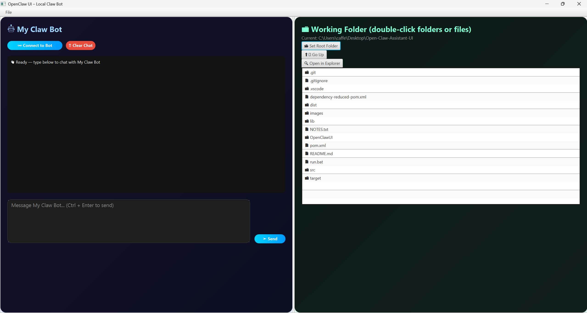
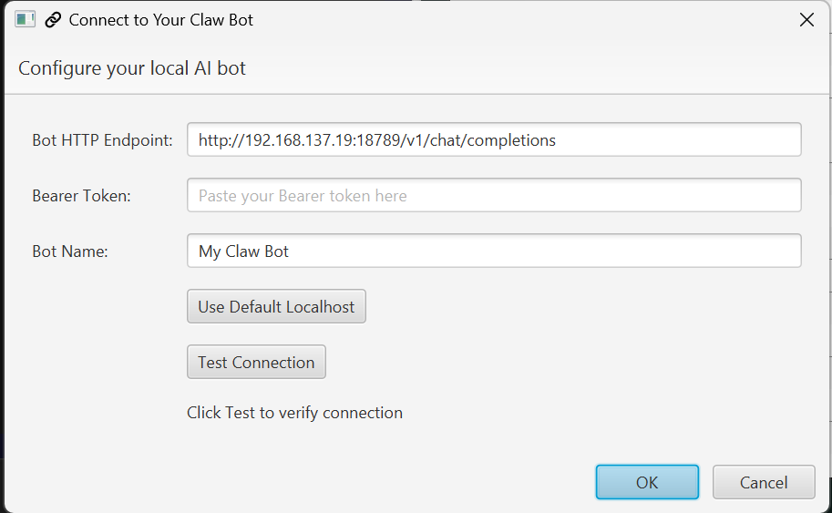

# OpenClaw UI – Desktop Interface for Local AI Interaction

## Project Description
OpenClaw UI is a modern JavaFX desktop application that provides an intuitive graphical interface for interacting with a locally running AI system (OpenClaw / Claw Bot gateway). Users can chat with their AI, manage a persistent working folder for training documents, double-click files to open them, customize the bot name, and save chat history automatically. The app is fully packaged as a single `.exe` so anyone can use it without installing Java or JavaFX.

## Quick Download
- **Open** OpenClawUI-DOWNLOAD_ZIP (https://github.com/Mason-Hite/Open-Claw-Assistant-UI/tree/main/OpenClawUI-DOWNLOAD_ZIP)
- **Click On** OpenClawUI-1.0.0.zip (https://github.com/Mason-Hite/Open-Claw-Assistant-UI/blob/main/OpenClawUI-DOWNLOAD_ZIP/OpenClawUI-1.0.0.zip)
- **CLICK** "View raw" (https://github.com/Mason-Hite/Open-Claw-Assistant-UI/raw/refs/heads/main/OpenClawUI-DOWNLOAD_ZIP/OpenClawUI-1.0.0.zip)
- The Zip (38.3 mbs approximately) will start to download
- After download, extract wherever. Continue below to "Configuration & Execution".

## Configuration & Execution
1. Run `OpenClawUI.exe`
2. Click **🔗 Connect to Bot**
3. Enter your local OpenClaw endpoint (usually `http://localhost:18789/api/chat` or similar)
4. Click **Test Connection**
5. Set your **Working Folder** (where your training files live)
6. Start chatting!

The app remembers your settings and chat history between sessions.

## Features
- Real-time chat with expandable multi-line input
- Persistent chat history saved in `AppData`
- Navigable file explorer (double-click folders to browse, double-click files to open)
- Custom bot name support
- Settings dialog with connection testing
- Clear Chat button with confirmation
- Undo Last Message using a `Stack`
- Clean modular design with resizable panels

## Dependencies & Installation
**Required:**
- Java 21 (or higher)
- Maven (for building from source)

**For end users (recommended):**
1. Download the latest release from this repository
2. Extract the `OpenClawUI` folder
3. Double-click `OpenClawUI.exe`

*No additional installation is required, everything is bundled.*

## Images of UI

- *RIGHT: Main chat window showing custom bot name, expandable input, and persistent conversation*
- *LEFT: Navigation-able working folder with double-click support for folders and files*

  
*Settings window for configuring endpoint and bot name*

## Repository & Software Design
The project uses a clean layered architecture:

- `ui/` – JavaFX GUI components (`MainWindow`, `ChatPanel`, `FilePanel`, `SettingsDialog`)
- `ai/` – HTTP communication with the local bot (`OpenClawClient`)
- `storage/` – Persistent chat history management (`ChatHistoryManager`)
- `models/` – Data models

**Design highlights:**
- Separation of concerns via packages
- Event-driven GUI with JavaFX
- Asynchronous networking (background threads)
- Persistent storage using Preferences and file I/O
- Maven + jpackage for native Windows executable

#### MAIN COLLECTION INFO AND EXPLAINATION:

### Use of Standard Java Collections

I implemented a `Stack<String>` for **undo functionality**.

### Why ListView (JavaFX) Was Chosen Over Plain Java Collections

While I could have used a plain `ArrayList<String>` to store chat messages, I deliberately chose **`ListView`** (backed by an `ObservableList`) for the following reasons:

- **UI Integration**: `ListView` is a full JavaFX control designed for real time display. It automatically handles scrolling, selection, and visual updates.
- **Live Updates**: Using `ObservableList` allows the UI to refresh instantly when messages are added or removed (no manual `refresh()` calls needed).
- **Thread Safety**: Updates from background threads (the AI response) are safely handled via `Platform.runLater()`.
- **User Experience**: Features like smooth scrolling and automatic height adjustment would have required significant extra code if using a plain `ArrayList` or similar.

Using a standard `ArrayList` would have forced me to manually sync data between the model and the UI, increasing complexity and risk of bugs. I believe `ListView` was the correct choice.

### Why `ListView` + `ObservableList` Was Chosen

In a graphical application like this, the choice of data structure is not just about storage, it’s about how efficiently the UI can stay in sync with the data.

### Plain `ArrayList<String>` (Standard Java Collection)
- **Time Complexity**:
  - `add()` at the end: **O(1)** amortized (average time)
  - `remove()` by index: **O(n)** (must shift all later elements)
  - `get()` by index: **O(1)**
- **Problem**: After every `add()` or `remove()`, you must manually call `chatHistory.refresh()` or rebuild the entire display. This leads to boilerplate code and risk of UI lag or desync.

### `ListView` + `ObservableList` (JavaFX)
- **Time Complexity**:
  - `add()` / `remove()`: **O(1)** at the end (same as ArrayList)
  - `get()` by index: **O(1)**
- **Theory**: `ObservableList` implements the **Observer Pattern**. When you call `add()` or `remove()`, JavaFX is notified instantly and only re-renders the changed parts of the `ListView`. This is called **data binding** (https://www.geeksforgeeks.org/java/data-binding-in-spring-mvc-with-example/).

### Why This Was the Right Decision
- **Live Updates**: The AI replies come from a background thread. Using `Platform.runLater()` + `ObservableList` guarantees the UI updates safely without freezing or race conditions.
- **Performance**: For a chat app that can grow to hundreds of messages, `ListView` only redraws what changed (virtualization). A plain list would require full refreshes.
- **User Experience**: Automatic scrolling to the bottom, selection handling, and smooth rendering come for free.
- **Assignment Fit**: While `ArrayList` would technically meet the "use a collection" requirement, `ListView` + `ObservableList` demonstrates **real-world application** of collections in a GUI context. Which I personally viewed for impressive for this assignment, even if it did limit the demonstration of the Java II concepts (As I originally decided to focus on).

In short: `ArrayList` is great for pure logic, but `ObservableList` + `ListView` is the correct tool when the data must be **displayed live** to the user.

## Citations
- JavaFX 21 Documentation
- OpenClaw API specification (local gateway)
- Maven Shade Plugin for bundling dependencies

## Challenges Overcome
- Packaging JavaFX into a single `.exe` without console window
- Making bot name changes and storing chat history
- Removing default ListView separator lines cleanly
- Ensuring chat history persists across application restarts

## UML Class Diagram
See `docs/UML.txt` and `docs/UML.png` in the repository.

## License
This project is licensed under the **GNU General Public License v3.0** — see the [LICENSE](LICENSE) file for details.
